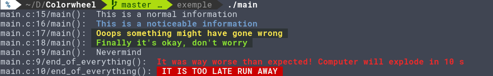

# colorwheel
Colorwheel provides easy-to-use colored print and trace macros for debuging your C or C++ program.

To install directly to your include path, run the following command : 

```bash
sudo wget -O /usr/include/colorwheel.h https://raw.githubusercontent.com/Totoditoto/colorwheel/master/colorwheel.h
```

Then include to your project using :

```c
#include <colorwheel.h>
```

### Macros

Here are the ready-to-use macros :

```c
/* Predefined printf styled messages */
CW_PRINT_NORMAL(message, ...);
CW_PRINT_ALARM(message, ...);
CW_PRINT_CRITICAL(message, ...);
CW_PRINT_FAULT(message, ...);
CW_PRINT_VALID(message, ...);
CW_PRINT_INFO(message, ...);

/* Predefined trace styled messages (indicates file, function and line) */
CW_TRACE_NORMAL(message, ...);
CW_TRACE_ALARM(message, ...);
CW_TRACE_CRITICAL(message, ...);
CW_TRACE_FAULT(message, ...);
CW_TRACE_VALID(message, ...);
CW_TRACE_INFO(message, ...);
```

### Example

Here's a little test program showing all predefined message styles :

```c

#include <colorwheel.h>

static int value = 10;

static void end_of_everything(void)
{
    CW_TRACE_CRITICAL("It was way worse than expected! Computer will explode in %d s", value);
    CW_TRACE_ALARM("IT IS TOO LATE RUN AWAY");
}

void main(void)
{
    CW_TRACE_NORMAL("This is a normal information");
    CW_TRACE_INFO("This is a noticeable information");
    CW_TRACE_FAULT("Ooops something might have gone wrong");
    CW_TRACE_VALID("Finally it's okay, don't worry");
    CW_TRACE_NORMAL("Nevermind");
    end_of_everything();
}

```

 
